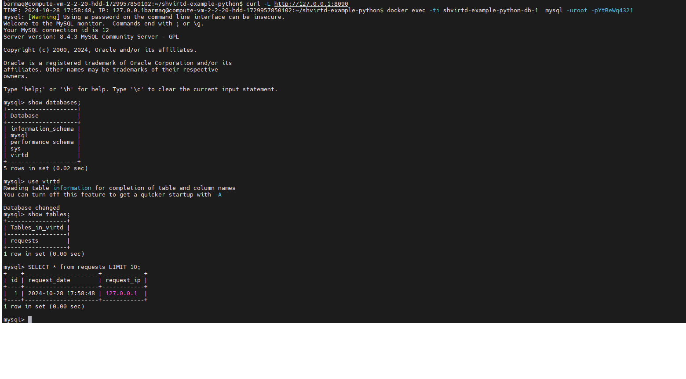

Задача 1 :
Сделайте в своем github пространстве fork netology-code/shvirtd-example-python, использовать dockerignore

----------------------------------
----------------------------------

Задача 2 :
собрать загрузить образ в в yandex cloud container registry. использовать инсструмент сканирования в yc и выложить отчет сканирования.
[отчет сканирования](res/scan.csv)

----------------------------------
----------------------------------

Задача 3 :
описать сервисы в compose.yaml, запустить, проверить. Выполнить SQL запрос и выложить скриншон

----------------------------------
----------------------------------

Задача 4:
написать скрипт который скачает ваш fork-репозиторий в каталог /opt и запустит проект целиком.
[скрипт для загрузки форка](res/homework_t4.sh)

проверить используя https://check-host.net/check-htt

ссылка на fork-репозиторий
https://github.com/barmaq/shvirtd-example-python

----------------------------------
----------------------------------

Задача 6.1 :
Скачайте docker образ hashicorp/terraform:latest и скопируйте бинарный файл /bin/terraform на свою локальную машину, используя dive и docker save. Предоставьте скриншоты действий

сохранил образ при помощи docker save. при помощи dive нашел слой с нужным файлом и запомнил id слоя. при помощи tar извлек файл

Задача 6.2

Добейтесь аналогичного результата, используя docker cp.
запустил контейнер, использовал docker cp
Предоставьте скриншоты действий .

